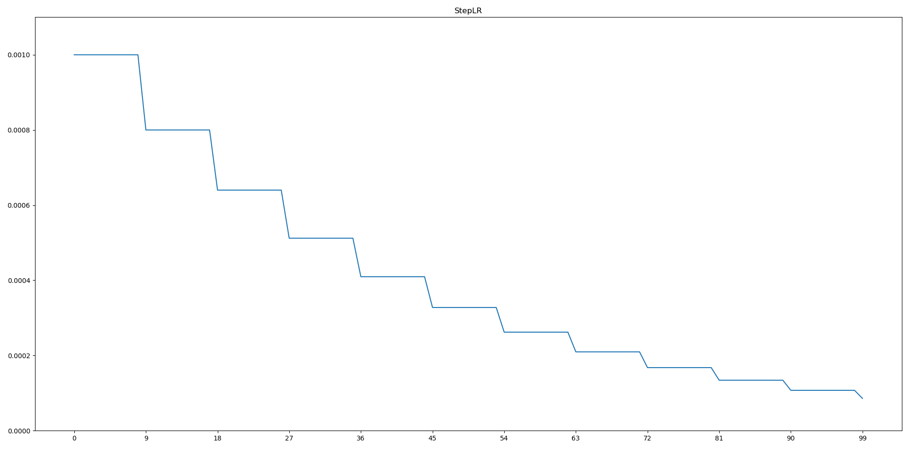

# lr-scheduler-visualization

> Visualize the progress of the learning rate scheduler graphically.

학습률 (Learning rate)은 딥러닝 모델을 학습시킬 때 사용하는 Optimizer의 가중치 변경 정도를 결정합니다. 이때 학습률이 고정되어 있으면 전역 최솟값(global minimum)에 도달하는데 시간이 오래걸립니다.

그러므로 학습 초기에는 빠르게 학습을 진행하고 수렴지점에 다다르면 학습률을 줄여서 최저점에 더욱 근접할 수 있도록 하는 방법이 필요합니다. 이를 구현할 수 있도록 PyTorch에서는 torch.optim.lr_scheduler라는 패키지를 제공합니다. [Document](https://pytorch.org/docs/stable/optim.html#how-to-adjust-learning-rate)를 보면 학습률의 변경 과정을 알 수 있지만, 그림으로 나와 있지 않아서 한눈에 보기 어렵습니다.

따라서 이 프로젝트는 lr_scheduler의 학습률 변경 과정을 그래프로 시각화합니다. epoch당 학습률을 표현하며 정확한 값은 콘솔창에 출력됩니다.

이 프로젝트가 유용히 사용되면 좋겠습니다. (●'◡'●)

## Project Introduction

- Motivation
  - lr_scheduler가 글로 설명되어 있어 직관적으로 알기가 힘들어서 만들었습니다.
- Purpose
  - lr_scheduler의 학습률 변경 과정을 그래프로 시각화한다.
- Main functions
  - Matplotlib로 각 epoch에서의 학습률 변경 과정을 시각화함.
  - 그래프로는 알기 힘든 정확한 학습률을 콘솔창에 표시

## Build Status

   

## How to Install

1. Anaconda 또는 Miniconda가 설치되어 있는지 확인하세요.

2. 새 가상환경을 만들고 아래의 개발 환경 섹션에서 언급한 라이브러리를 설치하세요.

   - ```
     conda install python=3.7 matplotlib tqdm
     ```

   - https://pytorch.org/get-started/locally/

3. 리포지토리를 클론, 포크하거나 압축파일로 코드를 다운로드하세요.

## How to Use, Example

1. 사용할 가상환경을 활성화하고 데이터셋의 경로를 확인합니다.

2. 아래의 명령을 실행합니다.

   ```shell
   $ python visualize_lr_scheduler.py
   ```

3. 그래프와 콘솔창을 확인합니다.

   

4. 기본 lr_scheduler는 StepLR이 적용되어 있습니다. 다른 스케줄러를 사용하려면 코드의 주석을 확인하세요.

   ```python
   # 다른 스케줄러를 사용하려면 아래의 코드 한줄을 변경하세요.
   scheduler = torch.optim.lr_scheduler.StepLR(optimizer, step_size=9, gamma=0.8)
   ```

## API, Framework

- Python 3.7.7
- PyTorch 1.5.0
- Matplotlib

## Develop environment

- S/W develop environment
  - Ubuntu 20.04 LTS (Cross platform)
  - Windows10 20H1 (Cross platform)
  - Miniconda
- Setting up develop environment
  1. Make sure you have Anaconda or Miniconda installed.
  2. Create a new virtual environment and install the above library.
  3. Download the code to your repository as a clone, fork or ZIP file.
  4. Open the downloaded file with your IDE or text editor.
  5. Start coding~!

## Contribution method

1. Fork this repository.
2. Create a new branch or use the master branch in the GitHub Desktop.
3. Commit the modification.
4. Push on the selected branch.
5. Please send a pull request.

## License

MIT License

You can find more information in `LICENSE`.
